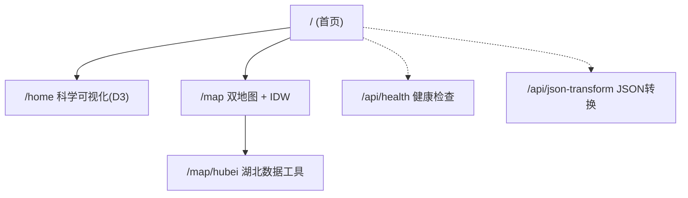
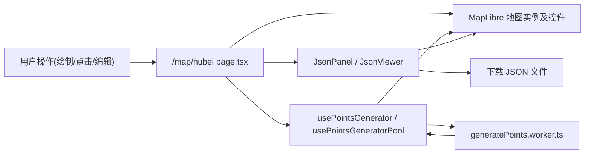

# Next Start 项目梳理与架构概览

> 本文对 `next-start` 项目进行整体梳理，便于后续规划与扩展。

## 一、项目定位与技术栈

### 1. 项目定位

- 基于 Next.js 15 的现代 Web 应用模板
- 集成 TailwindCSS、TypeScript、ESLint/Prettier 等工程化能力
- 内置地图可视化（MapLibre、turf）、科学可视化（D3、ECharts）示例
- 适合作为「带地理空间与数据可视化能力」的前端基础脚手架

### 2. 核心技术栈

- 框架：Next.js 15（App Router，`src/app`）
- 语言：TypeScript（`strict: true`）
- 样式：TailwindCSS
- 组件与状态：React 19 + 自定义 Hooks
- 国际化：`next-intl` + 自定义 `I18nProvider`
- 主题：`next-themes` 深浅色切换
- 数据库：Drizzle ORM + better-sqlite3（SQLite）
- 可视化：D3、ECharts（封装为 `useD3`、`useECharts`）
- 地图：MapLibre GL、Mapbox Draw、自定义地图控件、`@turf/turf`
- 工程化：ESLint + Prettier + Husky + lint-staged、pnpm、Docker

---

## 二、目录结构与分层

### 1. 顶层配置

- `package.json`：脚本、依赖、lint 配置
- `tsconfig.json`：TypeScript 编译与路径别名（`@/*` 等）
- `next.config.mjs`：Next.js 框架配置
- `tailwind.config.ts`：Tailwind 主题、字体、动画配置
- `eslint.config.mjs`、`.prettierrc`：代码规范与格式化规则

### 2. 应用层 `src/app`

- `layout.tsx`：根布局
  - 引入全局样式 `global.css`
  - 设置 HTML 语言、字体变量
  - 使用 `ClientLayout` 包裹所有页面（主题与国际化 Provider）
- `page.tsx`：根首页（Landing 页面）
- `not-found.tsx`：404 页面

#### 2.1 `/home` 路由（科学可视化 Demo）

路径：`src/app/home`

- `page.tsx`
  - 通过 `generateMockMEXTFromSmart` 将 `smartChart/mock.json` 转换为图表数据
  - 使用 `createMEXTChart` + `useD3` 渲染「消光系数热图 + 等值线」
  - 自定义 `colorThresholdSpec` 定义变量、单位、阈值区间和颜色
- `chart/*`
  - 封装 D3 绘制逻辑与图表配置

整体上，这是一个「科学/气象类二维场可视化」示例。

#### 2.2 `/map` 路由（双地图 + IDW 插值）

路径：`src/app/map`

- `page.tsx`

  - 左右两个 MapLibre 地图：
    - 左侧：网格数据展示（调用 `addGridBusiness`）
    - 右侧：散点数据展示（调用 `addPointsBusiness`，数据来自 `mock/point.json`）
  - 使用 `useMapState` 管理地图实例与状态：
    - `leftMap`、`rightMap`、`idwVisible`
    - 左右地图容器 Ref
  - 使用 `useMapBusinessLogic` 聚合地图业务：
    - `addGridBusiness`：网格相关图层与渲染
    - `addPointsBusiness`：点图层渲染
    - `transformIDW`：使用 IDW 插值将散点转换为格点数据
  - 使用 `useMapSync` 实现左右地图视图联动（缩放、平移同步）
  - 通过按钮切换：
    - `idwVisible` 为 false：执行 IDW 插值、显示格点等值面、隐藏原始点
    - `idwVisible` 为 true：隐藏 IDW 图层，恢复显示原始离散点

- `components`

  - `MapContainer.tsx`：地图容器组件，负责挂载地图实例与内部按钮
  - `MapToolbar.tsx`：地图工具条（按钮与操作入口）
  - `index.ts`：组件导出

- `hooks`

  - `useMapState.ts`：地图实例与 UI 状态管理
  - `useMapBusinessLogic.ts`：网格/点位/IDW 业务封装
  - `useMapSync.ts`：双地图交互同步

- `utils`

  - `initMap.ts`：
    - 基于 `maplibre-gl` 封装 `createMap`：
      - 合并默认控件配置与外部传入配置
      - 支持导航、比例尺、定位、复位、测距、缩放与中心点显示、自定义 Draw 控件
    - 使用 `foxGisVectorStyle`、`APP_BOUNDS` 等统一地图配置
  - `bounds.ts`、`grid.ts`：地图边界、网格计算等辅助逻辑
  - `plugins/*`：自定义地图控件
    - `GeolocateControl`、`MeasureControl`、`ResetControl`、`ZoomCenterControl`
    - `MapboxDrawControl`：集成 Mapbox Draw 功能

- `mock`

  - `point.json`：示例散点数据
  - `rain_thresholds.json`：降水阈值配置示例

- `types`
  - 描述 `MapConfig`、`MockPointsData`、`IdwConfig` 等地图相关类型

整体上，这是一个「双地图联动 + IDW 插值可视化」的示例场景。

#### 2.3 `/map/hubei` 路由（湖北数据工具页）

路径：`src/app/map/hubei`

- `page.tsx`

  - 单个 MapLibre 地图，用于展示湖北省行政区
  - 支持两类点数据来源：
    - 用户在地图上使用 Draw 工具绘制的点（`selectedSourceType = 'draw'`）
    - 系统根据行政区与模板随机生成的点（`selectedSourceType = 'generated'`）
  - 使用状态管理：
    - `selectedPointId`：当前选中的点 ID
    - `lastLngLat`：最后一次选中点的位置
    - `editorRaw`：JSON 编辑器内容
    - `templateRaw`：点属性模板 JSON
    - `selectedSourceType`：当前选中点来源（手绘 / 生成）
  - 地图初始化：
    - 调用 `createMap`，以湖北省中心点和缩放级别为默认视图
    - 设置 `maxBounds` 限制视图在中国范围内
  - 加载湖北行政区数据：
    - 从 `/json/420000_full.json` 拉取 GeoJSON
    - 添加 `hubei` 源与 `hubei-fill`、`hubei-outline` 图层
    - 使用 `map.on('mousemove', 'hubei-fill', ...)` 显示悬浮提示
  - Draw 事件监听：
    - `draw.create`、`draw.selectionchange`：更新选中点与地理坐标

- `components`

  - `JsonPanel.tsx`：
    - 包含 JSON 文本编辑区与按钮（应用、导出等）
    - 支持原始 JSON 字符串与解析后的数据双向联动
  - `JsonViewer.tsx`：
    - 递归 JSON 浏览组件
    - 支持搜索关键字并高亮显示

- `hooks`

  - `usePointsGenerator.ts`：
    - 基于湖北 GeoJSON 面数据、turf（`bbox`、`booleanPointInPolygon` 等）
    - 生成指定数量的随机点
  - `usePointsGeneratorPool.ts`：
    - 管理 Web Worker 池，在后台并行生成点，避免阻塞 UI

- `utils`

  - `splitDistrict.ts`：将湖北省 GeoJSON 按市、区拆分
  - `randomProps.ts`：按模板为点要素生成随机属性
  - `export.ts`：下载 JSON 文件（`downloadJson`）

- `workers`
  - `generatePoints.worker.ts`：
    - 在 Worker 中执行点生成计算
    - 通过消息与主线程通信，返回生成结果

整体上，这是一个「针对湖北省的点生成与 JSON 属性编辑工具」，可以用作保险、气象等领域的数据准备工具。

### 3. 组件层 `src/components`

- `layout`

  - `ClientLayout.tsx`：
    - 使用 `usePathname` 监听路由变化并滚动到顶部
    - 包裹 `ThemeProvider` 与 `I18nProvider`
  - `Navbar.tsx`：导航栏组件

- `providers`

  - `i18n-provider.tsx`：
    - 定义 `Locale` 类型（`'zh' | 'en'`）
    - 使用 Context 存储当前语言与切换方法
    - 使用 `NextIntlClientProvider` 提供文案
  - `theme-provider.tsx`：
    - 基于 `next-themes` 提供主题切换能力

- `features`

  - `LanguageSwitch.tsx`：中/英切换控件
  - `Quote.tsx`、`ScrollingText.tsx`、`analytics.tsx` 等特色组件

- `ui`
  - `card.tsx`：卡片组件
  - `split-pane.tsx`：左右可拖拽分割布局组件
  - `theme-switch.tsx`：主题切换按钮
  - `loading.tsx`：加载状态组件

### 4. 通用层与工具层

- `src/hooks`

  - `useEnv.ts`：读取环境变量
  - `useFontLoading.ts`：监控字体加载（结合 `fontfaceobserver`）
  - `index.ts`：集中导出

- `src/lib`

  - `db/drizzle.ts`：初始化 drizzle + better-sqlite3
  - `db/schema.ts`：定义 `users`、`posts` 表结构
  - `i18n/messages/*.json`：多语言文案（`en`、`zh`）

- `src/utils`

  - `web/useD3.ts`、`web/useECharts.ts`：封装 D3 与 ECharts Hook
  - `fonts.ts`：统一管理字体引入
  - `index.ts`：工具函数集中导出

- `src/styles`、`src/types`
  - 目前主要为 README 与占位目录，预留后续样式与类型规范扩展

---

## 三、路由与页面关系

简化路由关系如下：



说明：

- `RootLayout` 为所有页面提供统一的布局与 Provider
- `/home` 展示基于 D3 的科学可视化示例
- `/map` 展示双地图联动与 IDW 插值
- `/map/hubei` 提供针对湖北省的点生成、属性编辑与 JSON 工具
- `/api/*` 提供健康检查与 JSON 转换等基础 API 示例

---

## 四、运行、构建与质量命令

### 1. 开发与运行

- 安装依赖：

  ```bash
  pnpm install
  ```

- 本地开发：

  ```bash
  pnpm dev
  ```

  访问 `http://localhost:3000`。

- 生产构建与启动：

  ```bash
  pnpm build
  pnpm start
  ```

### 2. 代码质量

- Lint 检查：

  ```bash
  pnpm lint
  ```

- 自动修复：

  ```bash
  pnpm lint:fix
  ```

- 代码格式化：

  ```bash
  pnpm format
  ```

### 3. 清理与 Docker

- 清理构建产物：

  ```bash
  pnpm clean
  pnpm clean:all
  ```

- Docker 构建与运行：

  ```bash
  pnpm docker:build
  pnpm docker:up
  ```

  默认将容器 `3000` 端口映射到宿主机 `3001`。

---

## 五、架构分层与数据流

### 1. 分层映射

- UI 层：
  - `src/app/*/page.tsx` 页面
  - `src/components/*` 组件
- 逻辑/服务层：
  - 各类自定义 Hooks（尤其是 `src/app/map`、`src/app/map/hubei`）
  - `src/utils/web/*` 中的图表相关 Hook
- API 层：
  - `src/app/api/*/route.ts`（Next 15 route handlers）
- 数据层：
  - `src/lib/db/*`（Drizzle + SQLite）
  - `public/json/*` 静态数据
- 通用层：
  - `src/utils/*` 工具函数
  - `src/types/*` 类型定义（可进一步扩展）

### 2. 示例数据流（以 `/map/hubei` 为例）



---

## 六、后续演进建议

结合现有结构，建议后续可以从以下方向演进：

1. 服务层与业务模块化
   - 将地图与点生成等逻辑，从 Hooks 中进一步抽象到 `src/services/*`，保持页面只负责组装。
2. 类型体系统一
   - 在 `src/types` 中集中定义：
     - 可视化数据类型（例如 MEXT、阈值规范）
     - 地图相关类型（点、网格、行政区等）
     - JSON 工具相关类型（`JsonValue`、`JsonObject` 等）
   - 避免使用 `any` 类型。
3. 打通 API 与数据库
   - 基于 Drizzle 的 `users`、`posts` 表：
     - 提供 `/api/users` 等接口
     - 在前端增加简单的管理页面，演示全链路能力。
4. 抽象地图与图表配置
   - 将不同地图场景（湖南双图、湖北工具）抽象为配置对象：
     - 统一控制底图样式、控件、基础图层
   - 图表侧将阈值规范、图例布局等抽象成通用配置，便于复用。

本文件可作为项目的「整体说明」与后续架构设计的基础。
